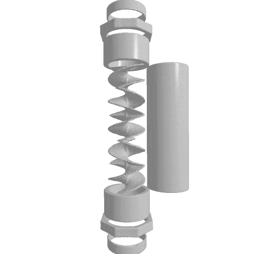

<h1 style="text-align: center;"> HybridSDF: Combining Deep Implicit Shapes and Geometric Primitives for 3D Shape Representation and Manipulation </h1>

<h1 style="text-align:center;"> /!\ Under construction! /!\ </h1>

<h2 style="text-align: center;">
    <a class="page-link" href="https://subeeshvasu.github.io/">Subeesh Vasu</a>*,1,
    <a class="page-link" href="https://ntalabot.github.io/">Nicolas Talabot</a>*,1, 
    <a class="page-link" href="https://scholar.google.com/citations?user=A9tNPiQAAAAJ&hl=en">Artem Lukoianov</a>1,2, 
    <a class="page-link" href="https://scholar.google.com/citations?user=u56iZPkAAAAJ&hl=en">Pierre Baqué</a>2, 
    <a class="page-link" href="https://scholar.google.com/citations?user=3hoYiLAAAAAJ&hl=en">Jonathan Donier</a>2, 
    <a class="page-link" href="https://people.epfl.ch/pascal.fua?lang=en">Pascal Fua</a>1
</h2>

<h3 style="text-align: center;"> 
    * Equal contributions  
    1 CVLab, EPFL  
    2 Neural concept 
</h3>

    

    

    <!-- 
<a href="" style="color: #fdfdfd;">Paper</a>
 -->
    
<a href="https://arxiv.org/abs/2109.10767" style="color: #fdfdfd;">arXiv</a>

    <!-- 
<a href="" style="color: #fdfdfd;">Video</a>
 -->

    <h1 style="text-align: center;">Abstract</h1>
    Deep implicit surfaces excel at modeling generic shapes but do not always capture the regularities present in manufactured objects, which is something simple geometric primitives are particularly good at. In this paper, we propose a representation combining latent and explicit parameters that can be decoded into a set of deep implicit and geometric shapes that are consistent with each other. As a result, we can effectively model both complex and highly regular shapes that coexist in manufactured objects. This enables our approach to manipulate 3D shapes in an efficient and precise manner.

<h3> TODO 1: Text only </h3>
TODO: Blablabla.

<h3> TODO 2: Picture and text </h3>

 Figure: Placeholder for a picture.

TODO: Blablabla.

 

 
<h3 style="text-align: right;"> TODO 3: Side-by-side picture and text </h3>
TODO: Blablabla.

<h3> BibTeX </h3>
  If you find our work useful, please cite it as:

    @inproceedings{vasutalabot2022hybridsdf,
      author = {Vasu, Subeesh and Talabot, Nicolas and Lukoianov, Artem and Baqu\'e, Pierre and Donier, Jonathan and Fua, Pascal},
      title = {HybridSDF: Combining Deep Implicit Shapes and Geometric Primitives for 3D Shape Representation and Manipulation},
      booktitle = 3DV,
      year = 2022
    }